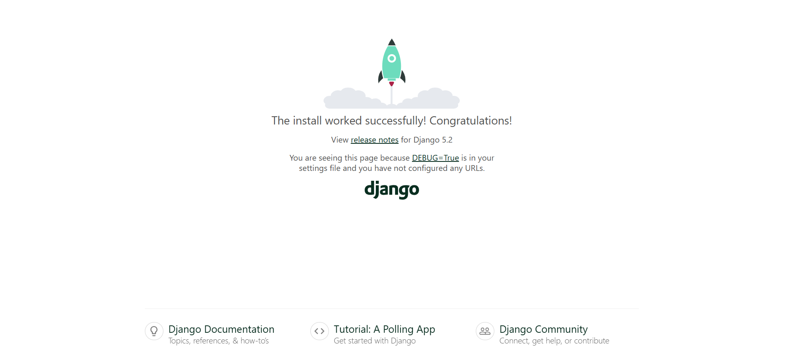

# Chapter 01: Installing Django

## Creating virtual environment

We will first start by creating a [virtual environment](https://realpython.com/python-virtual-environments-a-primer/). A virtual environment isolates your project dependencies to within the project you are working in so that it doesn't affect other projects, even if they use different versions of your dependencies.

```
python3 -m venv venv
```

## Activating virtual environment 

Now let's activate the virtual environment we created. You have to activate your virtual environment so that it can encapsulate the dependencies you will work with. Installing packages without it being activated in the first place is akin to dropping bombs outside the military zone. It is sure going to backfire on you.

```
source venv/bin/activate
```

## Installing django 

Now that we have activated a virtual environment, we can now install Django which will be *limited* to within the confines of that virtual environment. Any other project we create can use a different version of django without it being affected by the version we input here.

```
pip install django
```

## Storing requirements

Let's create a file that will list every package we will use in this journey. A short pen is better than a long memory anyway.

```
pip freeze > requirements.txt
```

## Create project 

Now let's create a Django project. But first, it is important to understand two concepts: 1) a project and, 2) an app in the context of Django.

Django project - a high-level unit of organization that contains logic that governs your whole web application. Each project can contain multiple apps.

Django app - a lower-level unit of your web application. You can have zero to many apps in a project.

Now let's create our project!

```
django-admin startproject sanitation
```

## Create app 

We want to duplicate the interactive dashboard showing all Australia's public toilets in our django app. It's not that we are mocking the country. The fact that I am using Australia here and in the dashboard is testament enough it holds high standards when it comes to ensuring proper sanitation countrywide. 

```
python3 manage.py startapp australia
```

This will create several files:

* `__init__`.py - tells Python to treat the directory as a Python package.

* admin.py - contains settings for the Django admin pages.

* apps.py - contains settings for the application configuration.

* models.py - contains a series of classes that Django’s ORM converts to database tables.

* tests.py - contains test classes.

* views.py - contains functions and classes that handle what data is displayed in the HTML templates.


## Peek inside the project folder

So this is how our directory looks like:

```
sanitation
├── manage.py
├── australia
│   ├── apps.py
│   ├── views.py
│   ├── migrations
│   │   └── __init__.py
│   ├── __init__.py
│   ├── admin.py
│   ├── tests.py
│   └── models.py
└── sanitation
    ├── wsgi.py
    ├── settings.py
    ├── __init__.py
    ├── asgi.py
    ├── urls.py
    └── __pycache__
        ├── __init__.cpython-310.pyc
        └── settings.cpython-310.pyc

4 directories, 15 files
```

Inside our `sanitation` project, this is how the directory structure looks like.

```
sanitation
    ├── wsgi.py
    ├── settings.py
    ├── __init__.py
    ├── asgi.py
    ├── urls.py
    └── __pycache__
        ├── __init__.cpython-310.pyc
        └── settings.cpython-310.pyc

```

Inside our `australia` app, this is how the structure looks like:

```
├── australia
│   ├── apps.py
│   ├── views.py
│   ├── migrations
│   │   └── __init__.py
│   ├── __init__.py
│   ├── admin.py
│   ├── tests.py
│   └── models.py
```

## Test if django is working

Run the following to check your Django version: 

`django-admin version`

To check whether Django is correctly working, run:

```
python3 manage.py runserver
``` 

If the following image pops up, then django is working all right!



