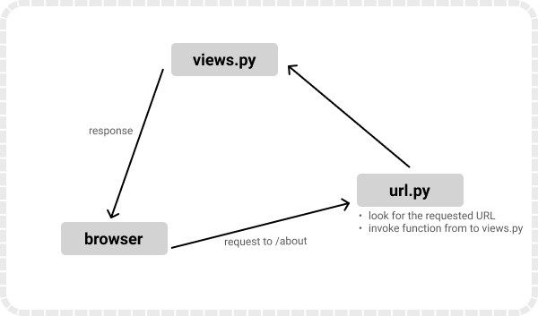

# Chapter 4: Routes

## What is a route in a django project?

Think of routes as signposts that guide a user to the right location. A [route](https://how.dev/answers/how-to-perform-url-routing-in-django) in Django is what determines how requests are mapped to specific codes in your application. A route is a Uniform Resource Locator (URL) that displays a particular webpage to the browser. Views are what process these requests and determine what get's back to the user. 



## Adding a route

To create a route, you need to hook up a URL so that you can visit the `australia` that you’ve just created. Your `sanitation` folder contains a file named `urls.py`. In this file, you’ll include a URL configuration for the `australia` app:

```
from django.contrib import admin
from django.urls import path, include

urlpatterns = [
    path('admin/', admin.site.urls),
    path("", include("australia.urls")),
]

```

By adding another `path()` to urlpatterns, you create a new route for your Django example project. Whenever you visit the root path of your project, the routes of the `australia` application will load. The `australia.urls` module doesn’t exist yet, so you’ll need to create it:

Inside `urls.py`, you need to import the path object as well as the app’s views module. Then you define a list of URL patterns that correspond to the various view functions. At the moment, you’ve only created one view function, so you only need to include one route:


```
from django.urls import path 
from australia import views

urlpatterns = [
    path("", views.home, name="home")
]

```

Now restart your Django development server via `python3 manage.py runserver`.

You get a print out as below:

```
Watching for file changes with StatReloader
Performing system checks...

System check identified no issues (0 silenced).

You have 18 unapplied migration(s). Your project may not work properly until you apply the migrations for app(s): admin, auth, contenttypes, sessions.
Run 'python manage.py migrate' to apply them.
April 18, 2025 - 17:09:53
Django version 5.2, using settings 'sanitation.settings'
Starting development server at http://127.0.0.1:8000/
Quit the server with CONTROL-C.
```

## Migrations in Django

Note the below statement as part of our printout:

```
You have 18 unapplied migration(s). Your project may not work properly until you apply the migrations for app(s): admin, auth, contenttypes, sessions.
Run 'python manage.py migrate' to apply them.
```

What on earth are *migrations*?

Migrations are like what commits are to Github. Let me make it more simple in case you haven't worked with Github before. Migrations are what tell Django to notice the new changes you have made to your Django models.

How do I make Django notice the changes I made to my app? You do so via `python3 manage.py makemigratons`. 

The `makemigrations` command tells Django how to make database(s) that correspond to the app you created.

So we hit `Ctrl + c` to stop our server, and run `python3 manage.py makemigratons`. We get the following message:

```
No changes detected
```

This is understandable since we haven't created any models. 

Now to update the database based on the models we created, you run:

```
python3 manage.py migrate
```

This will create the database that matches the model you defined. 

Below is our output.

```
Operations to perform:
  Apply all migrations: admin, auth, contenttypes, sessions
Running migrations:
  Applying contenttypes.0001_initial... OK
  Applying auth.0001_initial... OK
  Applying admin.0001_initial... OK
  Applying admin.0002_logentry_remove_auto_add... OK
  Applying admin.0003_logentry_add_action_flag_choices... OK
  Applying contenttypes.0002_remove_content_type_name... OK
  Applying auth.0002_alter_permission_name_max_length... OK
  Applying auth.0003_alter_user_email_max_length... OK
  Applying auth.0004_alter_user_username_opts... OK
  Applying auth.0005_alter_user_last_login_null... OK
  Applying auth.0006_require_contenttypes_0002... OK
  Applying auth.0007_alter_validators_add_error_messages... OK
  Applying auth.0008_alter_user_username_max_length... OK
  Applying auth.0009_alter_user_last_name_max_length... OK
  Applying auth.0010_alter_group_name_max_length... OK
  Applying auth.0011_update_proxy_permissions... OK
  Applying auth.0012_alter_user_first_name_max_length... OK
  Applying sessions.0001_initial... OK
```

Now, let's restart our server via `python3 manage.py runserver`.

This time round we don't get a warning that we have unapplied migrations. We also see our bland `australia` application come up.


