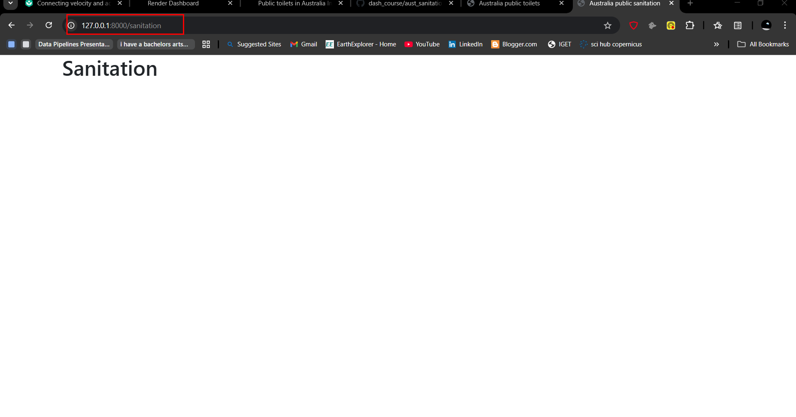

# Chapter 6: Webpages

## Adding a new webpage

Suppose we want to add a new webpage, the first thing to do would be to add a new html file within our `templates/australia` directory.

Name the new html file as `sanitation.html` and insert the following as a starter.

```




    <h1>Sanitation</h1>



```

Remember we are working with templates as described in the previous chapter so nothing new here. 

## Adding new webpage in `views.py` file

Since we have added a new html, we have to add it in our `views.py` file. A view in Django is a python function that takes in a web request and returns a web response. This is what will direct users to your page.

In the `views.py` of your `australia` app, insert the following function.

```
-- snip --
def sanitation(request):
    return render(request, "australia/sanitation.html", {})
```

## Adding new route

The `urls.py` file is responsible for connecting (mapping) the address of a page to its appropriate view. For example, you don't want your shopping url to open to the home page, and vice versa. When a user requests a URL, Django goes through the list of URL patterns defined in the `urls.py` file and finds the first pattern that matches the URL. If no pattern matches, Django returns a 404 error.

Let's add the url for sanitation in our `australia/urls.py` file.

```
urlpatterns = [
    path("", views.home, name="home"),
    path("sanitation", views.sanitation, name="sanitation"),
]

```

## Viewing the new webpage

Afterwards, let's rerun the server: `python manage.py runserver`.

Go to `http://127.0.0.1:8000/sanitation` and you will see your new webpage with the same bootstrap styles as used in the last chapter.




