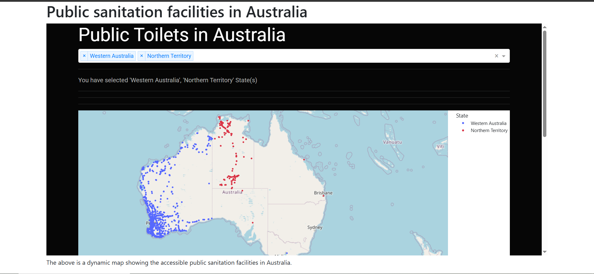

# Chapter 7: Dash in Django 

## What is Dash?

Dash is a low-code framework for building data visualization apps using Python. When combined with [Render](https://render.com/), a web-hosting platform, you have a strong combination of hosting your dash app to the global web.


## Rendering dash app in our django app

Truth be told, we tried all we could to render a Dash app inside our Django `sanitation` app using the steps outlined in this [document](https://www.etemkeskin.com/index.php/2020/11/08/how-is-dash-plotly-data-visualization-framework-used-in-django/?utm_source=pocket_shared) and [here](https://www.etemkeskin.com/index.php/2020/11/08/how-is-dash-plotly-data-visualization-framework-used-in-django/?utm_source=pocket_shared). However, we kept running into several errors until we threw in the towel and well, ultimately, we resorted to easier means. 

The below may sound like an amateurish method (and probably is) but it nevertheless enabled us to achieve the same end goal. HTML provides an `iframe` tag that enables one host a mini-webpage with the same webpage. The syntax is:

```
<iframe src="URL"></iframe>
```

Therefore, going back to the `sanitation.html` file within our `australia` folder, we shall add a `div` tag and some text to give some context to our dashboard.

```
templates
└── australia
    ├── sanitation.html
    └── home.html

```

First let's get the link to our Dash app deployed in render. Here is the [link](https://public-toilets-in-australia-infomap.onrender.com/). 

Previously, you `sanitation.html` template was as follows:

```




    <h1>Sanitation</h1>



```

Add the following `div` element inside your `sanitation.html` template. 

```

<div>
    <iframe src="https://public-toilets-in-australia-infomap.onrender.com" 
    width="100%" height="600px">

    </iframe>
</div>
```

As you can see, apart from inserting the url to our Dash app, we also specify the height and width of our webpage. 

For more context, we changed the `<h1>` tag and added a very short paragraph to provide more contextual basis. Here is the `sanitation.html` template at length.

```




<h1>Public sanitation facilities in Australia</h1>

<div>
    <iframe src="https://public-toilets-in-australia-infomap.onrender.com" 
    width="100%" height="600px">

    </iframe>
</div>

<div>
    <p>The above is a dynamic map showing the accessible 
        public sanitation facilities in Australia.
    </p>
</div>



```

## The Dash app rendered in our Django app

To display the Dash app in our Django app, first ensure that your virtual environment is already activated via `source venv/bin/activate`. Thereafter, run `python3 manage.py runserver` and go to `http://127.0.0.1:8000/sanitation`. If all is well, it will display the webpage shown below.





