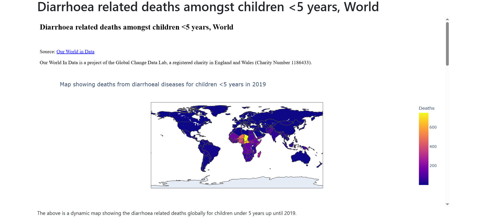

# Chapter 8: Another Django app

## Adding another app 

Now that we had practice with creating our `australia` app that shows the public sanitation facilities in Australia, and even rendered a mini-webpage of our Dash app in it, let's create a second app to concretize our Django skills.

The app we shall create shall render another Dash app of our [Diarrhoea related deaths among children under 5 years](https://data-visualization-for-diarrhoea-deaths.onrender.com/) dash app. Don't worry about the fanaticism with sanitation issues, it's just that the topic is close to our heart. 

## Create the app in Django 

We want to create an app called `world` that shows diarrhoea related deaths among children. 

The process of creating an app in Django is simple, simply add the name to your app in the command `python manage.py startapp <your-app-name>`. For our `world` app, it will be: 

```
python3 manage.py startapp world
```

This will create a folder called `world` with the following directories:

```
world
├── apps.py
├── views.py
├── migrations
│   └── __init__.py
├── __init__.py
├── admin.py
├── tests.py
└── models.py
```

Let's have a refresher of what each file does:

* `__init__.py` - tells Python to treat the directory as a Python package.

* `admin.py` - contains settings for the Django admin pages.

* `apps.py` - contains settings for the application configuration.

* `models.py` - contains a series of classes that Django’s ORM converts to database tables.

* `tests.py` - contains test classes.

* `views.py` - contains functions and classes that handle what data is displayed in the HTML templates.


## Install the app in your project 

Now let's install the app within our `sanitation` project. Go to the `settings.py` file under the `sanitation` directory. 

Add the following up to the `INSTALLED_APPS` key.

```
INSTALLED_APPS = [
    # my apps
    'australia.apps.AustraliaConfig',
    'world.apps.WorldConfig',
    
    'django.contrib.admin',
    'django.contrib.auth',
    'django.contrib.contenttypes',
    'django.contrib.sessions',
    'django.contrib.messages',
    'django.contrib.staticfiles',
]
```

By doing this, we make the Django configuration know that an app called `world` exists. 

The next step is to create a view to display some content on this app's webpage.

## Create a view 

A view in Django is a collection of functions or classes inside the `views.py` file in an app's directory. Each function or class handles the logic that the app processes each time the user visits a different URL.

Navigate to the `views.py` file in the `world` directory and add the following code:

```
# Create your views here.
def dysentry(request):
    return render(request, "world/dysentry.html", {})
```

In this piece of code, you define a view function named `dysentry()`. When you call this function, it’ll render an HTML file named `dysentry.html`. 

A view function takes at least one argument, `request`. The `request` object is created whenever a page loads, and it contains metadata about the page request.

Now that you’ve created the view function, you need to create the HTML template to display to the user. The `render()` function looks for HTML templates inside a directory called `templates/` in your app directory. Since templates of different apps can have the same names, it’s also best practice to add a subdirectory with the app’s name inside the `templates/` directory.

Create the `template/` directory, a subdirectory named `world/`, and subsequently a file named `dysentry.html` inside it:

## Content for the webpage

Open the `dysentry.html` file. Since we already created a base template and even have a skeleton of our `australia` app, we shall copy everything from the `sanitation.html` file save for the title name and the url in the `iframe` tag.

```




<h1>Diarrhoea related deaths amongst children <5 years, World</h1>

<div>
    <iframe src="https://data-visualization-for-diarrhoea-deaths.onrender.com/" 
    width="100%" height="600px">

    </iframe>
</div>

<div>
    <p>The above is a dynamic map showing the diarrhoea 
        related deaths globally for children under 5 years up until 2019.
    </p>
</div>



```

Now that you’ve created the template that your `dysentry` view function expects, you need to tell Django when to serve the view. For this, you need to create a new route to the project.


## Add a route 

First, you need to hook up an URL so that you can visit the page that you’ve just created. Your `sanitation/` folder contains a file named `urls.py`. In this file, you’ll include a URL configuration for the `world` app:

By adding another `path()` to `urlpatterns`, you create a new route for your Django `sanitation` project. Whenever you visit the root path of your project, the routes of the pages application will load. The `world.urls` module doesn’t exist yet, so you’ll need to create it by adding a `urls.py` file under the `world` directory.

```
world
├── apps.py
├── templates
│   └── world
│       └── dysentry.html
├── views.py
├── migrations
│   └── __init__.py
├── __init__.py
├── urls.py
├── admin.py
├── tests.py
└── models.py
```

Inside the `world/urls.py` file, add the following:

```
from django.urls import path  
from world import views 

urlpatterns = [
    path("dysentry", views.dysentry, name="dysentry"),
]

```

We define a list of URL patterns that correspond to the various view functions, which in our case is the `dysentry` view function. 

## View the app

To view our app, run `python3 manage.py runserver`.




