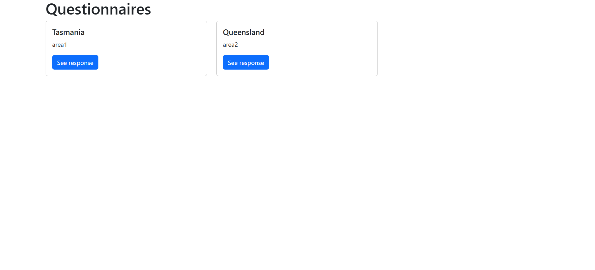
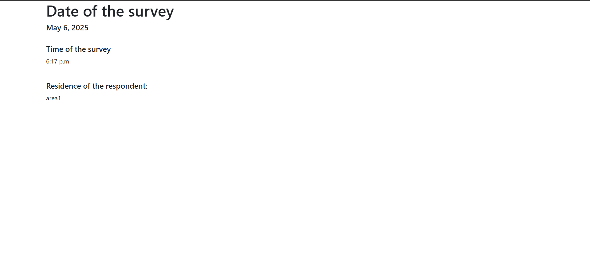

# Chapter 09: A model

## What is a model in Django?

A [Django model](https://www.geeksforgeeks.org/django-models/) is a built-in feature that Django uses to create tables, their fields and various constraints. In short, a Django model is the SQL Database one uses with Django. 

The basics of a model include: 

* Each model is a Python class that subclasses `django.db.models.Model` 

* Each attribute of the model represents a database field. 


## How to create models in Django?

In Django, models are defined inside a `models.py` script. 

We want to start simple. We want to assume that we want to create a database that for starters, captures the following information:

* `survey_date` - the date at which the survey was undertaken 

* `survey_time` - the time at which the survey was undertaken 

* `territory` - the administrative region at which the survey was undertaken 

* `area` - the state, town or neighbourhood the survey was carried out. Let's keep it very simple 


## Creating the class 

Models in Django are created under classes. We will create a class called `Questionnaire` which we shall use to create the model we want. 

```
# Create your models here.
class Questionnaire(models.Model):
```

We would like our first field to have a dropdown of the Australian territories. Therefore, within the `Questionnaire` class we create a list of constants:

```
class Questionnaire(models.Model):

    WA = "Western_Australia"
    NT = "Northern_Territory"
    QD = "Queensland"
    SA = "Southern_Australia"
    NSW = "New_South_Wales"
    TA = "Tasmania"

```

Now, let's create our proper territories list:

```
class Questionnaire(models.Model):

    WA = "Western_Australia"
    NT = "Northern_Territory"
    QD = "Queensland"
    SA = "Southern_Australia"
    NSW = "New_South_Wales"
    TA = "Tasmania"

    TERRITORY_CHOICES = [
        (WA, "Western Australia"),
        (NT, "Northern Territory"),
        (QD, "Queensland"),
        (SA, "Southern Australia"),
        (NSW, "New South Wales"),
        (TA, "Tasmania")
    ]

```

Why did we start with the list of constants? This is because we want the choices to be those that can be referenced in case we import the model inside another class.  

Now let's create the `territory` field which will contain our territory choices. 

```
    territory = models.CharField(
        choices=TERRITORY_CHOICES,
        default=WA
    )
```

Note that the `choices` parameter references the lists referenced by `TERRITORY_CHOICES`. 

Let's add a textfield in which the respondent will manually type out the area that they reside in.

```
area = models.TextField()

```

Just before the `territory` field, let's add `survey_date` and `survey_time` fields. We shall set the `auto_add_now` parameter to `True` so that the model automatically captures the current day and time respectively. So here is our `Questionnaire` class so far.

```
# Create your models here.
class Questionnaire(models.Model):

    WA = "Western_Australia"
    NT = "Northern_Territory"
    QD = "Queensland"
    SA = "Southern_Australia"
    NSW = "New_South_Wales"
    TA = "Tasmania"

    TERRITORY_CHOICES = [
        (WA, "Western Australia"),
        (NT, "Northern Territory"),
        (QD, "Queensland"),
        (SA, "Southern Australia"),
        (NSW, "New South Wales"),
        (TA, "Tasmania")
    ]

    survey_date = models.DateField(auto_now_add=True)

    survey_time = models.TimeField(auto_now_add=True)

    territory = models.CharField(
        choices=TERRITORY_CHOICES,
        default=WA
    )

    area = models.TextField()


```

## Migrate the model 

Now that you have created your model and updated it, it is time to migrate the model in Django. Why are we doing this? Initially, our `australia/models.py` file was empty apart from the first line of `from django.db import models` which imports the `models` package. Since we have created and updated a new model, we have to generate migration files that capture the changes in a human-readable format. Furthermore, we will specify in which app to generate the migration files for, that is the `australia` app.

```
python3 manage.py makemigrations australia

```

If you run the `makemigrations` command without the `australia` flag, it will run migrations for the entire project, which is *ideally* not what we want. 

Running this command creates a database called `db.sqlite3` within our project folder. 

```
sanitation
├── db.sqlite3
```

The migration files are stored in our app's `migrations` directory. 

Now that the changes have been captured, how we do we apply them into our database? The changes recorded in the migration files are captured using the `migrate` command. Again, we specified that we only wanted to apply the changes for the `australia` app.

```
python3 manage.py migrate australia

```

## Django shell 

To create instances of our `Questionnaire` class, we will use Django shell. This is a scripting language much like Python shell which enables us to access the sqlite database. To start using the Django shell interface, type:

```
python manage.py shell
```

You will know you are inside the Django shell when you see three carets (`>>>`).

First import the `Questionnaire` model.

```
from australia.models import Questionnaire
```

Let's create an instance of our first questionnaire and fill some values. 

```
first_questionnaire = Questionnaire(
... territory="Tasmania",
... area="area1"
... )
```

Thereafter, save this instance into your database using `first_questionnaire.save()`. This creates a new entry into our Questionnaire table and into our database. 

Let's create a second instance. 

```
second_questionnaire = Questionnaire(
... territory="Queensland",
... area="area2"
... )

```

Now save it into the database.

```
second_questionnaire.save()
```

To exit the Django shell, type `exit()`. 

## Create the views 

We want to create the views that will be used in designing our multiple page app. We want our `australia` app to have two web pages. One is for showing the total questionnaires that have been filled while the second will go into detail at what has been filled into each questionnaire. 

Let's start with the first web page that provides a general overview of the responses. We shall name this webpage `questionnaires`. 

You will first import the `Questionnaire` model at the top of your `australia/views.py`

```
from australia.models import Questionnaire 
```
Here is the view:

```
def questionnaire_index(request):
    questionnaires = Questionnaire.objects.all()
    context = {
        "questionnaires": questionnaires
    }
    return render(request, "australia/questionnaires.html", context)

```

Let's go over the above code block. 

`def questionnaire_index()` - this is the function name we shall use to create the function that will retrieve the project details. 

`questionnaires = Questionnaire.objects.all()` - this retrieves all values from the `Questionnaire` table. 

`context = {...}` - this is a dictionary that stores all values retrieved by the `questionnaires` variable. When `context` is passed into the `render()` function, it provides all the retrieved values to the template. 

We also want to have a webpage which will provide further details when a template is clicked. For example, say I click the template for the first questionnaire. This will open another webpage that shows additional contents of the responses collected by the first questionnaire. 

Let's create the function called `questionnaire_details` for showing additional details of the responses. 

```
def questionnaire_detail(request, pk):
    questionnaire = Questionnaire.objects.get(pk=pk)
    context = {
        "questionnaire": questionnaire
    }
    return render(request, "australia/questionnaire_detail.html", context)
```

Most of the components in this function are similar to those in the `questionnaire_index` function. However, inside the parentheses of the function name we can see a `pk` parameter. In Django, the `pk` parameter refers to the primary key of every record in your database. This primary key is provided by Django automatically, and is an auto-incrementing integer that progressively increases in the order of 1, 2, 3 and so on. You can access any record in your Django database by using this `pk` notation.

Since the primary key (`pk`) we are using is the default provided by Django, we pass it to the `questionnaire` variable as `pk=pk` inside `Questionnaire.objects.get()`.


## Create the templates 

Now that we've created the views, it's time we create the templates that will show what is defined by the views. Inside the `templates/australia`, create two new templates, `questionnaires.html` and `questionnaire_detail.html`. 

Inside the `questionnaires.html` insert the following code. 

```





<h1> Questionnaires </h1>

<div class="row">
    

    <div class="col-md-4">

        <div class="card mb-2">

            <div class="card-body">

                <h5 class="card-title">{{ question.territory }}</h5>

                <p class="card-text">{{ question.area }}</p>

                <a href=""

                   class="btn btn-primary">

                    See response

                </a>

            </div>

        </div>

    </div>

    

</div>




```

As mentioned in [Chapter 5](05-base-template.md#creating-a-basehtml-file), the `` copies the base template we defined in the `templates` folder at project level. The ` ` simply copies the Bootstrap template in our `base.html` and whatever is encapsulated within its block inherits the bootstrap theme found in `base.html`. 

However, we also introduce something else; a [jinja](https://jinja.palletsprojects.com/en/stable/) `for` loop. The ` `. This is similar to a python `for` loop only that it is written in jinja syntax. The `` breaks out of the loop. 

Inside this `for` loop we find the `{{ question.territory }}` and `{{ question.area }}` jinja tags. They stand for each value looped by the `` which references the `questionnaires` variable in `questionnaires = Questionnaire.objects.all()` of the `Questionnaire` class. 

Therefore, in essence the `for` loop will display all information filled on the `territory` and `area` field for each round of survey.

Finally, we have the `<a></a>` tag containing the `""` url reference. The `<a></a>` creates links and in this case it creates a button called `See response`. Clicking on this button will take us to the `questionnaire_detail.html` that contains more information on the response that was filled in.

The template of `questionnaire_detail.html` looks below.

```




<h1> Date of the survey </h1>
<h5> {{ questionnaire.survey_date }} </h5>

<div class="row">
    <div class="col-md-4">
        
        <br>
        <h5>Time of the survey</h5>
        <p> {{ questionnaire.survey_time }}</p>
        <br>
        <h5>Residence of the respondent:</h5>
        <p>{{ questionnaire.area }}</p>
        <br>
        
    </div>
</div>



```

The template is very similar to the `questionnaires.html` webpage. In this case, however, it will reference the `questionnaire` variable which is in the `questionnaire_detail` function of our `australia/views.py`. Django will use the primary key of the item clicked inside `questionnaires.html` to display more data, in this case `survey_date` and `survey_time` inside a different webpage called `questionnaire_detail.html`. In other words, the `survey_date`, `survey_time` and `area` of the item clicked in `questionnaires.html` will show up in the `questionnaire_detail.html` webpage. This url of this additional data will be `http://127.0.0.1:8000/australia/questionnaires/<primary_key>/`.

## Add the routes 

The routes are the urls which will be used to access your webpage(s). Create a `australia/urls.py` file that will contain your urls. First of all, you will import your views.

```
from australia import views
```

Importing the views inside `australia/views.py` will enable us to get the python functions which define the content that gets shown in our templates as methods. For example, below we access the `questionnaire_index` and `questionnaire_detail` functions as methods via `views.questionnaire_index` and `views.questionnaire_detail`. 

```
urlpatterns = [
    path("", views.home, name="home"),
    path("sanitation", views.sanitation, name="sanitation"),
    path("questionnaires", views.questionnaire_index, name="questionnaires"),
    path("questionnaires/<int:pk>/", views.questionnaire_detail, name="questionnaire_detail"),
]

```

The `<int:pk>` stands for the integer for the primary key in focus, which is ultimately a particular response.

Now that we have added the urls inside our `australia` app, it is time we also inform our project app, -- `sanitation` app that there is a new urls file inside the `australia` app.

In your `sanitation/urls.py` file add the path to your `australia/urls.py` file as shown below.

```
urlpatterns = [
    path("", views.home, name="home"),
    path("sanitation", views.sanitation, name="sanitation"),
    path("questionnaires", views.questionnaire_index, name="questionnaires"),
    path("questionnaires/<int:pk>/", views.questionnaire_detail, name="questionnaire_detail"),
]
```

Thereafter, run `python3 manage.py runserver`. Go to the `http://127.0.0.1:8000/questionnaires` url. Notice the last bit, `questionnaires` corresponds to the route name defined in the `path()` function inside our `australia/urls.py` file.

```
path("questionnaires", ...),
```


Click on the *See response*, it opens a new webpage with the primary number of the response. For example `http://127.0.0.1:8000/australia/questionnaires/1/`. Again, this path corresponds to the route name we defined in the `path()` function found in `australia/urls.py` file. 

```
path("questionnaires/<int:pk>/", ...),
```

