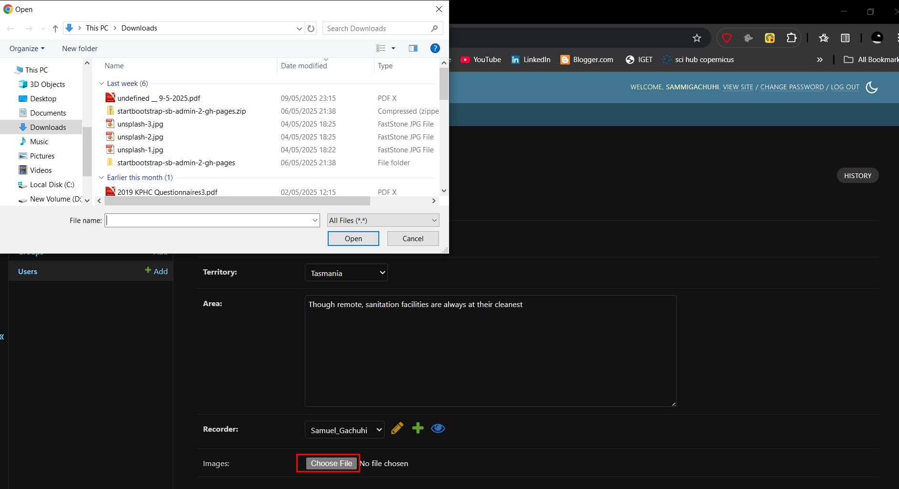
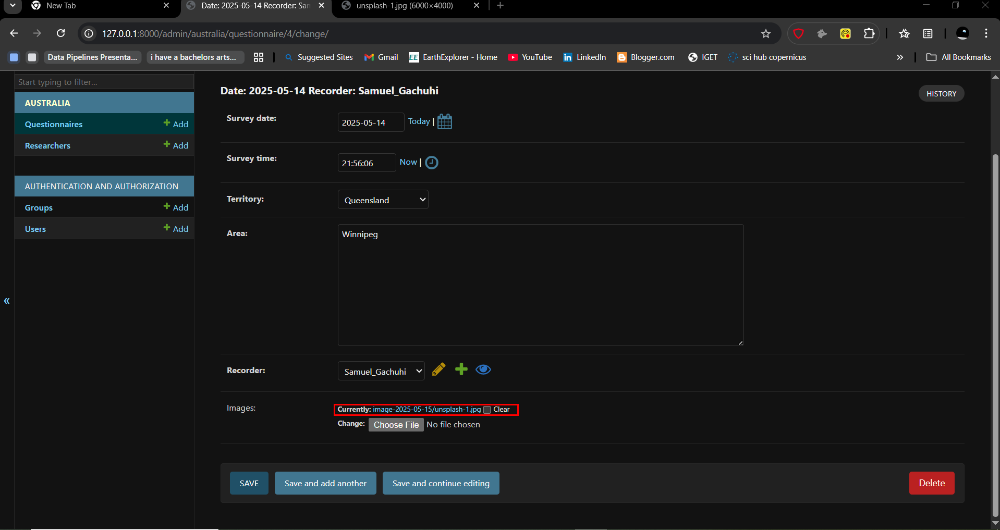

# Chapter 13: Images in Django

## Adding images

They say an image is worth a thousand words. We would like our question to have the option of uploading an image. However, this component will be optional, in that if a respondent doesn't like it they can just leave it blank. 

Let's proceed and do so.

## Add a `images` field in `models.py`

Go to your `australia/models.py` and add the following to the **Questionnaire** model, right at the bottom and just before the `def __str__()` function. 

```
class Questionnaire(models.Model):

    --snip--

    recorder = models.ForeignKey(Researcher, on_delete=models.CASCADE,)

    # images 
    images = models.FileField(upload_to="image-%Y-%m-%d", blank=True)

    def __str__(self):
        return f"Date: {self.survey_date} Recorder: {self.recorder}"

```

The `models.FileField` is responsible for enabling upload of files in your Django app. The `upload_to` parameter provides a way of setting up the upload directory and file name. We have beautified it in that it will also show the year-month-day as part of the path of the uploaded file. We set `blank` to `True` so that it's possible for one fill and save the questionnaire without uploading an image.

## Updating `settings.py` for images

In your `sanitations/settings.py` file, at the very bottom, add the following two lines of code.

```
MEDIA_ROOT = BASE_DIR / "uploads"
MEDIA_URL = "media/"

```

The `MEDIA_ROOT` setting constructs the path to the upload folder while the `MEDIA_URL` will provide the url to the uploaded file.

## Update the `urls.py` file 

Remember urls are responsible for routing, and we want our images to be rendered somewhere. We will therefore add the route for our uploads in the `sanitation/urls.py` file. 


```
from django.contrib import admin
from django.urls import path, include
from django.conf import settings
from django.conf.urls.static import static

-- snip --

] + static(settings.MEDIA_URL, document_root=settings.MEDIA_ROOT)

```

## Perform migrations 

Now let's save the migrations that we've done.

```
python3 manage.py makemigrations australia
```

Now that we've taken a snapshot of the migrations, its time to implement the changes in our database.

```
python3 manage.py migrate australia
```

You will see our changes have been added into the `australia/migrations` folder. 


## Rerun the server

As always, seeing is believing. Therefore rerun your server via `python3 manage.py runserver`. Go to the **Questionnaire** tab. You can create a new one or update an existing questionnaire. Open the *questionnaire* and you will see an **images** field. Upload any image of your choice using this button. Once done, hit **SAVE**. 



If you recheck the same questionnaire again, you will see a link to the images. If you wish to get rid of the image, just check the **Clear** box and hit **SAVE** again. 


