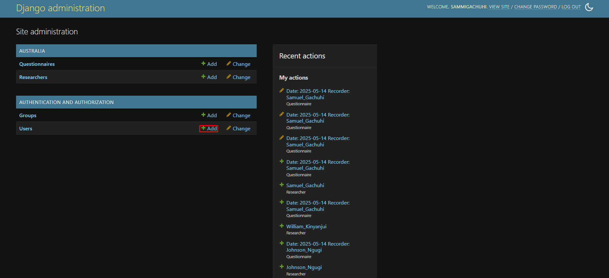
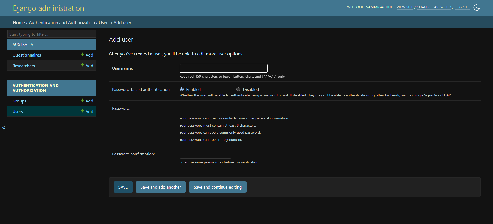
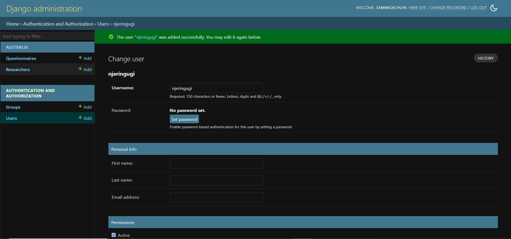
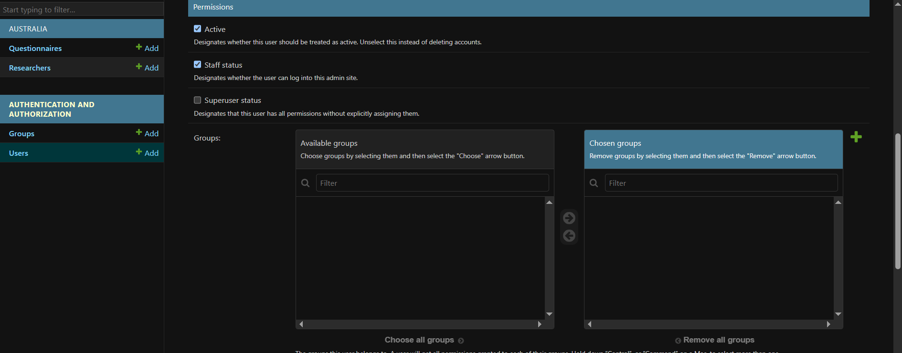
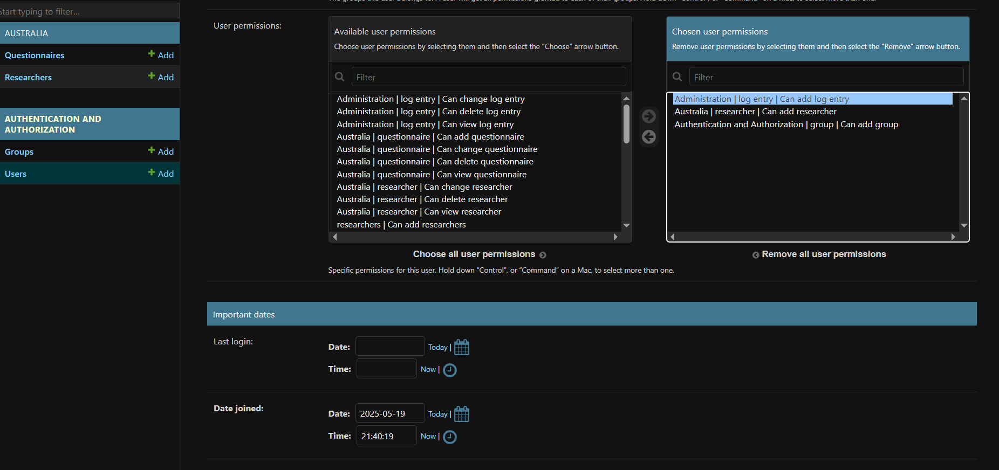
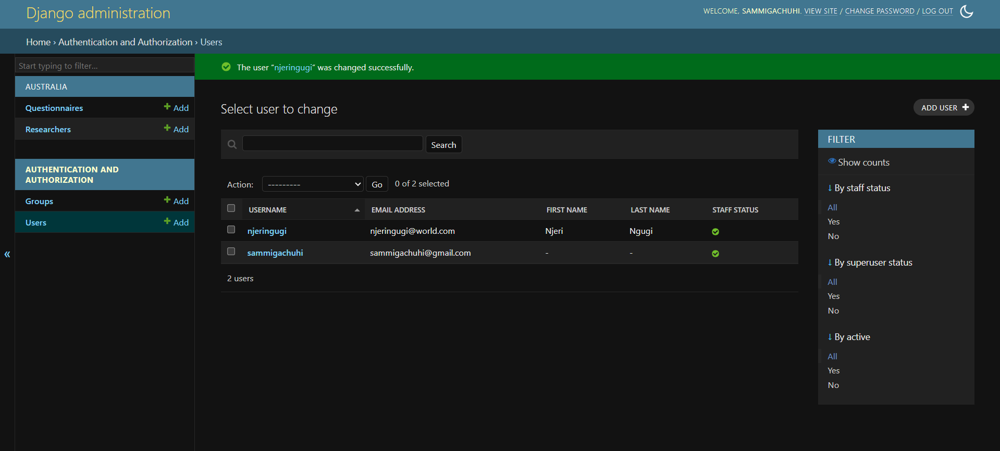

# Chapter 14: Adding users

## Adding other users

As a superadmin, like the chief administrator of your database, you have the veto rights to add and remove other users. 

It's very easy to add another user. 

Simply ensure that your server is up and running by typing out: `python3 manage.py runserver`. Thereafter, login to your django-admin account. 

Under the **Authentication** and **Authorization** pane, click **Users**. 

**NB** You can also add users by clicking the *+Add* button. 

## Insert new user details

Once you click *+Add* user, a new window will open. It shall look like below.

You can decide whether your new users will require a password or single sign-on. In this case, we went with the former.

Once you click **SAVE**, a new window with fields requiring more details of the new user will show up.

## New user priviledges 

There is the **Personal Info** site and the **Permissions** section. The latter is more important. 

We shall ensure the permissions **Active** and **Staff status** are all checked. If the **Staff status** is not checked, the user will not be able to log in to the django admin site.

Under the **User permissions**, select the following permissions from the **Availabe user permissions** box and use the right arrow to move them to the **Chosen user permissions** box. The latter are what will be available to the new user *njeringugi*.

Click **SAVE** once done. 

If you log out and login using the credentials of your new user, they will only have the privilidges you provided to them.

It is recommended you explore adding other users and groups.

