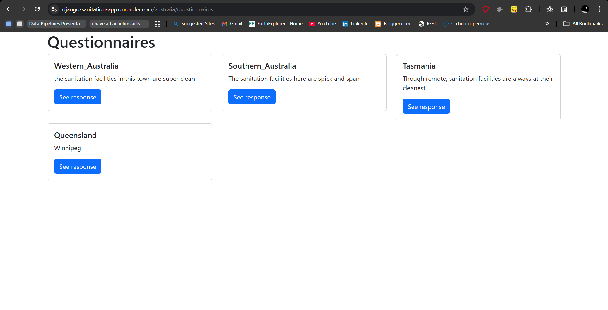

# Chapter 15: The Render server

## What is render

[Render](https://render.com/about) is a deployment service that enables developers ship their applications to production with minimal code and reduced time. 

## Deploying our Django app to render 

Inasmuch Render endeavours to make deployment painless, there are a few steps we need to undertake. 

The first involves installing the necessary packages that will make our deployment process as smooth as possible. 

Ensure that your virtual environment is active, that you are within the `sanitation/` project folder and install the following packages: `gunicorn`, `whitehouse` and `psycopg2-binary`.

```
pip install gunicorn whitenoise psycopg2-binary
```

Now create a `requirements.txt` file that will contain all the packages that you have installed ever since you started your Django project. Still within the `sanitation` project directory, run the following:

```
pip freeze > requirements.txt
```

The above line of code will create a `requirements.txt` file within your project folder that will contain all the packages you've installed in the virtual environment of your project. 

## Modify the `settings.py` file 

Now, we want our Django app to run on any [host](https://labex.io/questions/how-to-configure-django-allowed-hosts-153741) server. To do so, we will set our `ALLOWED_HOSTS` variable to `['*']`. 

```
ALLOWED_HOSTS = ['*']
```

However, if we wanted to only allow a specific host in which our Django app would run, we would have inserted the host name inside the square brackets. 

The `ALLOWED_HOSTS` variable is important in allowing the Django app to accept requests from certain domains. But for now, we want to dynamically work with any host server.


## Configure static files for `WhiteNoise`

`WhiteNoise` is a package that enables your webapp to serve its own static files. Static files are files that don't change when your application is running and include your Javascript, HTML and Cascade Styling Sheet (CSS) files. Without whitenoise, you would require external servers such as Amazon S3 to serve your app's static files. 

Add the following line at the top of your `settings.py` file.

```
import os

```

Insert the following lines at the very bottom of your `settings.py` file.

```
STATIC_ROOT = os.path.join(BASE_DIR, 'staticfiles')
STATICFILES_STORAGE = "whitenoise.storage.CompressedManifestStaticFilesStorage"

```

`STATIC_ROOT` -  tells Django where to put your static files when you prepare your site for deployment.

`STATICFILES_STORAGE` - tells Django how to handle and serve those static files, specifically using WhiteNoise to compress them, give them unique names for better caching, and set up proper caching rules.

The above two lines are important in enabling your webapp render pages quickly while live!

## Run migrations

Having defined the settings on how to [render our static files](https://www.geeksforgeeks.org/everything-about-django-collectstatic-command/), next is to migrate all our changes and deploy our Django app to Render.

Run the following code:

```
python manage.py collectstatic --noinput

```

The `collectstatic` command is a built-in Django management command that collects all static files from our project, including files from each installed app, and then places them into a single location, specified by the `STATIC_ROOT` setting. This location is where our web server will look for static files to serve to the end users.

When we run the `python manage.py collectstatic --noinput`, we are executing the above actions but our `--noinput` tells the deployment server to continue deploying the static files without requiring any user input, which might cause the app or the deployment process to hang.

Thereafter, to implement our migrations we run `python3 manage.py makemigrations` and `python3 manage.py migrate` in that order.

Save your Django app to Github.

## Render

Create an account in Render and proceed to **Create a web service** menu.

Connect Render to the Github account containing your Django app.

Give your Project a name. In our case it was `Django sanitation app`.

Select the **Region** you would like your services to be hosted. In our case -- `Singapore (Southeast Asia)`.

Specify the Github branch holding your Django project. In our case it is `main` branch.

For **Root Directory**, specify the directory containing all your Django apps. If all your Django apps are in the root directory, no need to specify this. However, if all your apps are within a single directory, such as `sanitation/` in our case, go ahead and specify this. Once you write the root directory, Render will autopopulate the root directory name in the subsequent text boxes.

For **Build Command**, insert `pip install -r requirements.txt`. 

For **Start Command**, insert `python manage.py runserver 0.0.0.0:8000`.

For the **Environment Variables**, insert `PYTHON_VERSION` and `3.10.12` in the **Key** and **Value** fields respectively.

Click on **Create web service** and Render will build and deploy your app. 

If you would like to visually follow along the above steps, watching this video which will be very helpful as it similar to our case. [video](https://www.youtube.com/watch?v=MPGoy5rp1GE)

Our app is found on this link: https://django-sanitation-app.onrender.com/.

Our other links such as for `australia` and `questionnaire` still work. 

https://django-sanitation-app.onrender.com/australia/

https://django-sanitation-app.onrender.com/australia/questionnaires

Click on a questionnaire and see it open up our responses!




