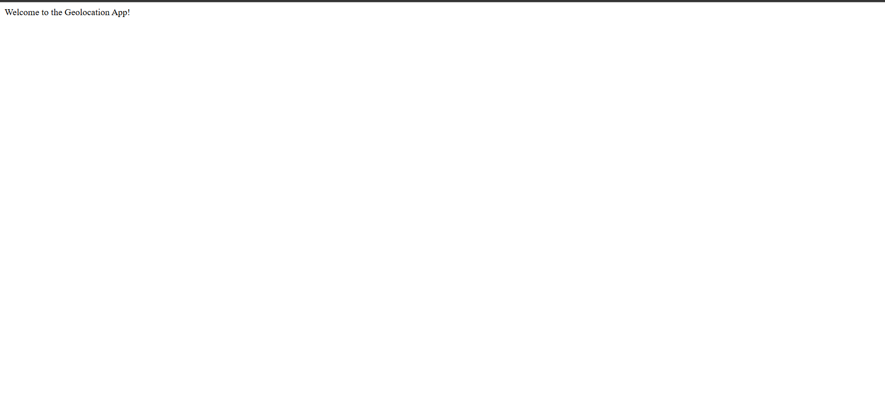

# Chapter 18: Geodjango model 

## Model outline

Let's assume we are researchers who are going to collect responses on the age, crops grown and the county at which the farmer is cultivating their produce.

We want to design a form that will collect responses to the following fields:

1. Researchers - a multi-select question that inserts the names of all researchers involved in the project.

2. Recorder - the person conducting the survey.

3. Responder name - the person responding to the survey (optional)

4. Location - the geographic coordinates of where the survey is being carried out. This field will collect the coordinates as a point layer.

5. Age - this is the age of the respondent 

6. Crops - a multi-select dropdown question that allows the recorder to select the crops grown

7. Image - an image of the respondent's farm (optional).

8. Comments - a textfield that allows the recorder to add any additional textual information.

## Designing the model 

Let's create our first model that will capture the name of the researcher.

At the very beginning of our `models.py` import the necessary models.

```
from django.db import models
from django.contrib.gis.db import models
```

Now here is the class to capture our researchers' names.

```
class Researcher(models.Model):

    full_name = models.CharField(max_length=50)

    def __str__(self):
        return self.full_name

```

Now add the following class that will capture the rest of the fields of: *recorder, responder name, location, age, crops, image* and *comments* fields. Notice that the `Recorder` field is related to the `Researchers` field via a many-to-one relationship as exemplified by the `ForeignKey` field. 

```
class Question(models.Model):

    CROPS = {
        "maize": "Maize",
        "wheat": "Wheat",
        "rice": "Rice",
        "potatoes": "Potatoes",
        "green_grams": "Green grams",
        "beans": "Beans",
        "sugarcane": "Sugarcane",
        "arrowroots": "Arrow roots"
    }

    recorder = models.ForeignKey(Researcher, on_delete=models.CASCADE)
    names = models.CharField(max_length=100)
    location = models.PointField()
    age = models.IntegerField()
    crops = models.CharField(
        choices=CROPS,
        default="potatoes"
    )

    image = models.ImageField(upload_to='images/')

    comments = models.TextField()

    def __str__(self):
        return f"{self.recorder} {self.names} {self.location} {self.age} {self.crops}"

```

## Create a media folder

Because we will be uploading images, we have to create a `media/` folder which shall store the images that shall be uploaded locally. 

Within your `my_geodjango` directory, create a `media/` folder and within it create an `images` folder.

```
media
└── images
```

## Image configurations in the `settings.py` file 

Since we also want to capture images, we shall add two new variables in the `settings.py` file.

```
MEDIA_URL = "/media/"
MEDIA_ROOT = BASE_DIR / "media"

```

## Urls and views 

Also, we shall add a new addition to the `agriculture/urls.py` file. At the very top, import the `include`, `settings`, and `static` packages.

```
from django.contrib import admin
from django.urls import path, include 
from django.conf import settings
from django.conf.urls.static import static
```

Then add the static images to the `urlpatterns` variable.

```
urlpatterns = [
    path('admin/', admin.site.urls),
    path("", include("geolocations.urls")),
] + static(settings.MEDIA_URL, document_root=settings.MEDIA_ROOT)

```

Let's go to the `geolocations/views.py` file. 

Let's create a simple home page.

```
from django.shortcuts import render
from django.http import HttpResponse
# Create your views here.
def home(request):
    return HttpResponse("Welcome to the Geolocation App!")

```

Create a `geolocations/urls.py` file and create the `urlpatterns` for the homepage view of our `geolocations` app.

```
from django.urls import path
from . import views

urlpatterns = [
    path("", views.home, name="home"), 
]

```

## Configurations in the `admin.py` file 

In the `geolocations/admin.py` file, we shall import some new tools.

Here we go.

```
from django.contrib import admin
from .models import Researcher, Question
# from django.contrib.gis.admin import OSMGeoAdmin
from django.contrib.gis.admin import GISModelAdmin

```

Let's also register our models.

```
@admin.register(Researcher)
class ResearcherAdmin(admin.ModelAdmin):
    list_display = ('full_name',)

@admin.register(Question)
class QuestionAdmin(GISModelAdmin):
    list_display = ('recorder', 'names', 'location', 'age', 'crops',)

```

## Running the server 

Now let's fire up our server.

```
python3 manage.py runserver
```

When you open your local host `http://127.0.0.1:8000/`, you will meet an unappealing welcome message.



If you proceed to the *admin* webpage (http://127.0.0.1:8000/admin/) you will see the two models of *Researcher* and *Question* that we created.


Proceed to add some recorders' names under **Researchers**, and proceed to fill some fields under the **Questions** model.You will notice that the dropdown in the **Recorder** field is dependent on the names you inserted in the **Researcher** class.

The values you defined in the `list_display` variable are what will be shown in the **Questions** interface of our admin webpage. 


