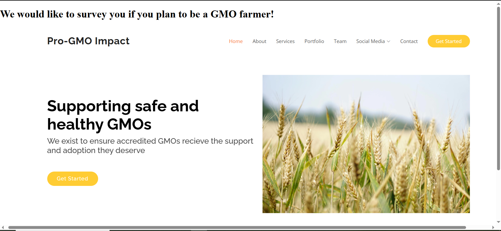
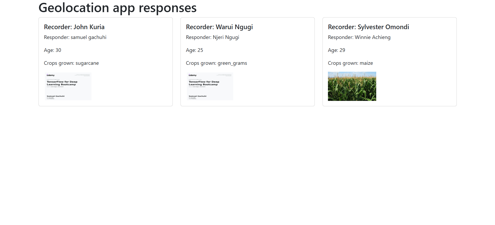

# Chapter 19: A Geodjango template

We want to create some templates. In Django, a [template](https://docs.djangoproject.com/en/5.2/topics/templates/) contains the static part of the desired HTML output as well as some syntax that describes how a dynamic content will be inserted. 

We will create some templates for:

1. Our geolocations homepage.

2. Our geolocations responses

3. A webmap for where each of our surveys took place 


## Create the `templates` folder

Within our `geolocations` app, create `templates` folder and within it create the `geolocations` folder. We use this naming convention of `app_name/templates/app_name` to avoid clashes with other apps that may have the same name.

Within the `geolocations/templates/geolocations` directory, create an `index.html` file. So your templates structure will look like:

```
geolocations
├── apps.py
├── templates
│   └── geolocations
│       └── index.html

```

Within the `index.html` file, insert the below content.

```
<!DOCTYPE html>
<html lang="en">
<head>
    <meta charset="UTF-8">
    <meta name="viewport" content="width=device-width, initial-scale=1.0">
    <title>Geolocations app</title>
</head>
<body>
    <h1>We would like to survey you if you plan to be a GMO farmer!</h1>
    <embed src="https://sammigachuhi.github.io/pro-gmo-website/" type="text/html" width="1600px" height="800px">
</body>
</html>
```

This is a nested website that also hosts the Pro-GMO website from [here](https://sammigachuhi.github.io/pro-gmo-website/). We use the `<embed>` tag to embed the Pro-GMO website within our `index.html`. 

## Configuring the views

Go to your `geolocations/views.py` file. Change the home function from returning a simple HttpsResponse via `return HttpsResponse` to rendering a html page via the `render()` function. 

```
def home(request):
    return render(request, "geolocations/index.html", {})
```

Now, if you run `python3 manage.py runserver` and go to your local host `http://127.0.0.1:8000/`, you will see our homepage as below.




## Create the base template 

We would like to create a template that fulfills purpose #2: *Our geolocations responses*.

As the first thing, create a `templates` folder within the `my_geodjango` directory. Inside this `templates` folder, create a `base.html` file which shall be the base template for all of our app's templates.

```
templates
└── base.html
```

Inside the `base.html` insert the following content:

```
<!DOCTYPE html>
<html lang="en">
<head>
    <meta charset="UTF-8">
    <meta name="viewport" content="width=device-width, initial-scale=1.0">
    <title> Geolocation responses </title>
    <link href="https://cdn.jsdelivr.net/npm/bootstrap@5.3.5/dist/css/bootstrap.min.css" rel="stylesheet" integrity="sha384-SgOJa3DmI69IUzQ2PVdRZhwQ+dy64/BUtbMJw1MZ8t5HZApcHrRKUc4W0kG879m7" crossorigin="anonymous">
</head>
<body class="container">
    <script src="https://cdn.jsdelivr.net/npm/bootstrap@5.3.5/dist/js/bootstrap.bundle.min.js" integrity="sha384-k6d4wzSIapyDyv1kpU366/PK5hCdSbCRGRCMv+eplOQJWyd1fbcAu9OCUj5zNLiq" crossorigin="anonymous"></script>
     
    
    
</body>
</html>

```

In a master template, the block tag is a placeholder that will be replaced by a block in a child template with the same name. That is, the styling of the block shall remain as defined in the master template, but the content inserted shall be to your own customization.

## Create the child template 

Within your `templates/geolocations` folder, create a `responses.html` template. Thereafter, insert the following content:

```




<h1> Geolocation app responses </h1>

<div class="row">
    

    <div class="col-md-4">

        <div class="card mb-2">

            <div class="card-body">

                <h5 class="card-title">Recorder: {{ response.recorder }}</h5>

                <p class="card-text">Responder: {{ response.names }}</p>

                <p class="card-text">Age: {{ response.age }}</p>

                <p class="card-text">Crops grown: {{ response.crops }}</p>

                

                    
                
                

                    <p> No image available </p>

                

            </div>

        </div>

    </div>

    

</div>


```

Here we use a `for` loop within the jinja template to go through every response stored in the variable called `responses`. You may ask, where is this value called `responses` stored? We shall create it in the `geolocations/views.py` file.

Go back to your `geolocations/views.py` file. 

First import the `Question` class from your `models.py` file. 

```
from .models import Question
```

Thereafter add the following content.

```
def responses(request):
    responses = Question.objects.all()
    context = {
        "responses": responses,
    }

    return render(request, "geolocations/responses.html", context)

```

Let's go through each variable.

The `responses` variable captures all content, that is, all the responses captured in the `Question` class. These include the `recorder`, `names`, `location`, `age`, `crops`, `image` and `comments` responses. It stores them inside a variable called `context`. 

Then in the last line, we render the contents inside a static html page called `responses.html` which contains only a subset of the responses we want to display!

## The `urls.py` file

Finally, in the `urls.py` file, we add the routing to our `responses.html` file.

```
urlpatterns = [
    path("", views.home, name="home"), 
    path("responses/", views.responses, name="responses"),
]

```

Now when we restart our server, and go to `http://127.0.0.1:8000/responses/` we can see the responses to some of our questions and their images. 




