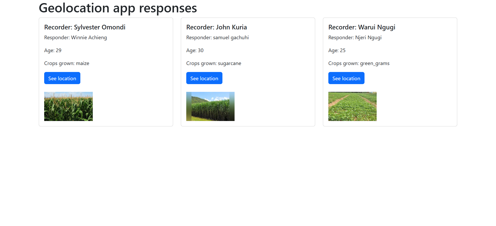
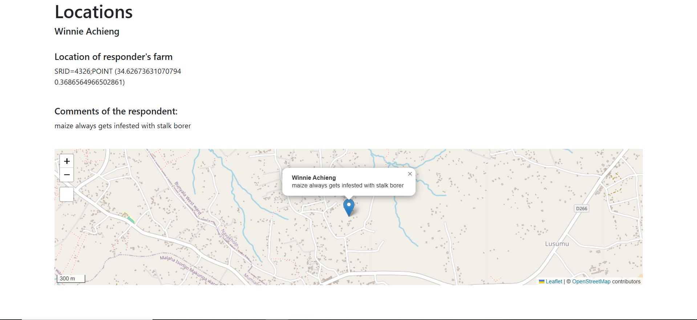

# Chapter 20: Django leaflet

## What is Leaflet?

[Leaflet](https://leafletjs.com/) is the leading JavaScript library for mobile-friendly interactive webmaps. Leaflet can also be integrated in Django and this gives rise to the term `django-leaflet`.

The goal of this chapter is to create a template that shows the points we clicked on the map when providing responses to our django admin page. 

## Installing Leaflet 

To install Leaflet, ensure that your virtual environment is active and run:

```
pip install django-leaflet
```

## Configure the settings

Add `leaflet` and `django-geojson` to your list of `INSTALLED_APPS`.

```
INSTALLED_APPS = [
    # my apps
    'geolocations',
    'django.contrib.gis',
    'leaflet',
    #
    'django.contrib.admin',
    'django.contrib.auth',
    'django.contrib.contenttypes',
    'django.contrib.sessions',
    'django.contrib.messages',
    'django.contrib.staticfiles',
]

```


## Configure templates

We want a webmap to appear when the user clicks on a link in the `responses.html` file. 

Right under the `<p></p>` tags of *Crops grown:* value, insert the following `<a></a>` tag. 

```
<a href=""

                   class="btn btn-primary">

                    See location

                </a>

```

Additionally, add two breaklines via `<br>` to space out between the button and the images we added.

```
<br>
<br>
```

Now, let's create a new template called `locations.html`. We want this template to display the respondent's name, show their location and comments. 

Create a `locations.html` within the `templates/geolocations` folder. Your directory structure should look like below.

```
geolocations
├── apps.py
├── templates
│   └── geolocations
│       ├── index.html
│       ├── locations.html
│       └── responses.html

```

Inside the `locations.html`, paste the below content. 

```







<h1> Locations </h1>
<h5> {{ response.names }} </h5>

<div class="row">
    <div class="col-md-4">
        
        <br>
        <h5> Location of responder's farm </h5>
        <p> {{ response.location }}</p>
        <br>
        <h5> Comments of the respondent: </h5>
        <p>{{ response.comments }}</p>
        <br>
        
    </div>
</div>

<div>
    
</div>

{# Place Leaflet CSS and JS *before* your custom script that uses L #}



<script type="text/javascript">
    // IMPORTANT: Set the path for Leaflet's default marker icons
    // This often fixes the 'marker not showing' issue if images aren't found.
    // Ensure the version (e.g., 1.9.4) matches what django-leaflet loads.
    L.Icon.Default.imagePath = 'https://unpkg.com/leaflet@1.9.4/dist/images/';

    function map_init(map, options) {
        // Get point coordinates. They will be strings from the template.
        // Leaflet will usually convert numeric strings to numbers.
        var lon = "{{ response.location.x }}"; // Access x directly if it's a PointField
        var lat = "{{ response.location.y }}"; // Access y directly if it's a PointField

        console.log("Map Init: Received Lat:", lat, "Lon:", lon); // Debugging: Check values

        // Convert to numbers if needed (optional, but good practice)
        var latNum = parseFloat(lat);
        var lonNum = parseFloat(lon);

        // Check if coordinates are valid numbers
        if (isNaN(latNum) || isNaN(lonNum)) {
            console.error("Invalid coordinates received for map: Lat=", lat, "Lon=", lon);
            map.setView([0, 0], 2); // Fallback to a default view
            return; // Exit if coordinates are bad
        }

        // Set the map view to the coordinates and a suitable zoom level
        // Leaflet's setView expects [latitude, longitude]
        map.setView([latNum, lonNum], 15); // Zoom level 15 is usually good for a single point

        // Add the marker to the map
        // Leaflet's L.marker expects [latitude, longitude]
        L.marker([latNum, lonNum]).addTo(map)
            .bindPopup("<b>{{ response.names }}</b><br>{{ response.comments }}") // Add a popup
            .openPopup(); // Open the popup by default
        
        console.log("Marker added at Lat:", latNum, "Lon:", lonNum); // Debugging: Confirm marker added
    }
</script>


```

## Overview of the template 

We first load the `base.html` of the leaflet_tags and base content block.

```





```

We then add the content that will be displayed.

```
<h1> Locations </h1>
<h5> {{ response.names }} </h5>

<div class="row">
    <div class="col-md-4">
        
        <br>
        <h5> Location of responder's farm </h5>
        <p> {{ response.location }}</p>
        <br>
        <h5> Comments of the respondent: </h5>
        <p>{{ response.comments }}</p>
        <br>
        
    </div>
</div>

```

Thereafter, the following line fires up the rendering of our Leaflet map.

```
<div>
    
</div>
```

This is followed by inserting the CSS and JavaScript to be used by Leaflet.

```



```

After that comes the `script` tag. This is what contains the contents that will be rendered on our map. 

We first begin by telling Leaflet where it should find the markers via the following one liner code:

```
L.Icon.Default.imagePath = 'https://unpkg.com/leaflet@1.9.4/dist/images/';
```

We create a `map_init` function that takes the longitude and latitude values of the location you inserted in your django admin.

```
var lon = "{{ response.location.x }}"; // Access x directly if it's a PointField
var lat = "{{ response.location.y }}"; 

```

We set the map to a suitable zoom level.

```
map.setView([latNum, lonNum], 15);
```

We finally set up a marker that shows the respondent's name and comment.

```
L.marker([latNum, lonNum]).addTo(map)
            .bindPopup("<b>{{ response.names }}</b><br>{{ response.comments }}") // Add a popup
            .openPopup(); // Open the popup by default
```

There are other intermediate lines of code that are used for debugging such as the `if` statement and `console.log()` at the bottom. See the entire html file in [Github](https://github.com/sammigachuhi/my_geodjango/blob/main/geolocations/templates/geolocations/locations.html).

## Configure the `views.py` file

Let's add a function that shall display our location on the webmap.

```
def locations(request, pk):

    response = Question.objects.get(pk=pk)

    context = {
        "response": response,
    }

    return render(request, "geolocations/locations.html", context)

```

The above function relies on the primary key of an object to display the response. This primary key (pk) can be relied on to differientiate which responses are displayed by a particular webpage. You will see this when we configure our `urls.py` file.

## Configure the `urls.py` file

We shall add the routing to our `locations.html` template but we shall add a value that shows which response corresponds to the selected map location. 

```
urlpatterns = [
    path("", views.home, name="home"), 
    path("responses/", views.responses, name="responses"),
    path("locations/<int:pk>/", views.locations, name="locations"),
]

```

Now let's run the server and the `http://127.0.0.1:8000/responses/` link should look like below.



If you click on the **See location** button, it should take you to a webmap showing the point locations that were selected in the admin for that particular respondent.

