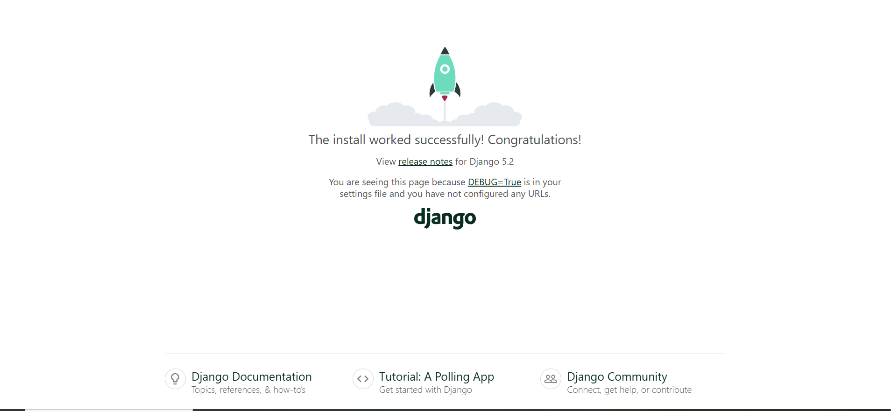

# Chapter 16: Geodjango

## What is geodjango?

[Geodjango](https://www.lifeingis.com/geodjango-tutorial-series/?mode=grid) is a python module for developing Geographic Information Systems (GIS) applications. A [Geographic Information System (GIS)](https://www.usgs.gov/faqs/what-a-geographic-information-system-gis) is a computer system that analyzes and displays geographically referenced information. It uses data that is attached to a unique location.

Geodjango enables us to create geographic web applications using the Django framework. 

## Create a new Django project 

Because Geodjango is a stand alone framework just like Django, and even though we could apply it in our `sanitation` project, we prefer to start on a clean slate this time round. 

Startup wsl2 again and create a new directory called `my_geodjango`.

```
mkdir my_geodjango/
```

Get into that directory via `cd my_geodjango/`. 

Open that directory in vs code by typing `code .`.

## Create a virtual environment

First things first. Let's create a virtual environment. If you've followed us from [Chapter 1](#create-a-virtual-environment) so far, you know that a virtual environment is important in containerizing our project and preventing conflicts due to disparate packages across projects. 

```
python3 -m venv venv
```

Now let's activate this virtual environment. 

```
source venv/bin/activate
```

You should now see your placeholder name appended with `(venv)` next to it. 

## Installing Django 

Now let's install the motherboard for our project, the Django framework.

```
pip install Django
```

## Create Django project

Now let's create our Geodjango project called `agriculture`. 

```
django-admin startproject agriculture .
```

Note the dot (`.`). The period (`.`) prevents Django from creating a nested directory. That is, it prevents Django from creating another directory called `agriculture` within the `agriculture` directory. This is what happened the first time when we were creating the `sanitation` project in [Chapter 1](#create-a-new-django-project).

I personally prefer this second approach since it keeps my folders tidy. 

```
my_geodjango
├── agriculture
│   ├── --snip --
│   
├── venv
│   ├── -- snip --

```

Now let's test if our `agriculture` Django project is working by instantiating the server.

```
python3 manage.py runserver

```



Good.

## Create the `geolocations` app

We will create an app called `geolocations` that will be used to collect our geographic coordinates. This is the app that we will be reliant on the Geodjango framework.

```
python3 manage.py startapp geolocations

```

A new folder called `geolocations` should appear.

In the `settings.py` file of your `agriculture/` directory, go to the `INSTALLED_APPS` variable and add the `geolocations` app.

```
INSTALLED_APPS = [
    # my apps
    'geolocations',

    #
    'django.contrib.admin',
    'django.contrib.auth',
    'django.contrib.contenttypes',
    'django.contrib.sessions',
    'django.contrib.messages',
    'django.contrib.staticfiles',
]

```


